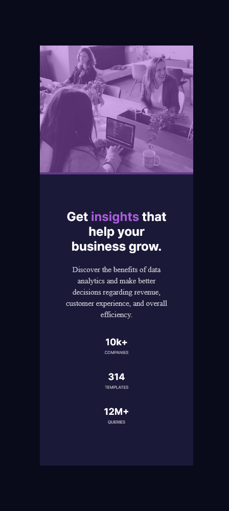

# Frontend Mentor - Stats preview card component solution

This is a solution to the [Stats preview card component challenge on Frontend Mentor](https://www.frontendmentor.io/challenges/stats-preview-card-component-8JqbgoU62). Frontend Mentor challenges help you improve your coding skills by building realistic projects. 

## Table of contents

- [Overview](#overview)
  - [The challenge](#the-challenge)
  - [Screenshot](#screenshot)
  - [Links](#links)
  - [Built with](#built-with)
  - [What I learned](#what-i-learned)
  - [Continued development](#continued-development)
  - [Useful resources](#useful-resources)
- [Author](#author)
- [Acknowledgments](#acknowledgments)

## Overview

This is a basic design to show the statistics of a company using HTML, CSS and Flexbox.

### The challenge

Users should be able to:

- View the optimal layout depending on their device's screen size

### Screenshot

(./images.Desktop-view.png)

### Links

- Solution URL: [Add solution URL here](https://your-solution-url.com)
- Live Site URL: [Add live site URL here](https://your-live-site-url.com)

### Built with

- Semantic HTML5 markup
- CSS custom properties
- CSS Grid

### What I learned

The most important ting I learnt from this challenge were gradient colr overlay, display and flex-direction especially column-reverse for the mobile design.

### Continued development

Using pseudoclasses and gradients overlay.

### Useful resources

- [resource 1](https://youtu.be/mT10ZJdlh9Y - This tutorial taught me a great way to use pseudoclasses and overlay color on my image.

- [resource 2](https://youtu.be/qZv-rNx0jEA) - This is the ultimate flexbox tutorial, helped me grasp the concept.

## Author

Oyindamola Oseni
- Frontend Mentor - [@oyinoseni](https://www.frontendmentor.io/profile/oyinoseni)
- Twitter - [@_damola_](https://www.twitter.com/_damola)

## Acknowledgments

Special thanks to Zuri and Ingressive4Good for helping me kickstart my coding journey. Super grateful for Youtube tutors Alex Carpenter, Steve Griffin, The Net Ninja and Colt Steele.

